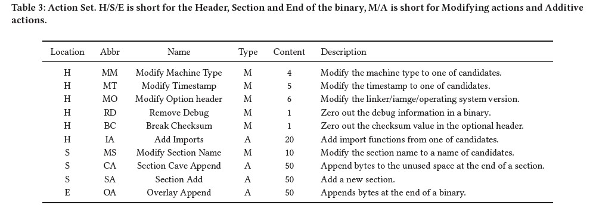
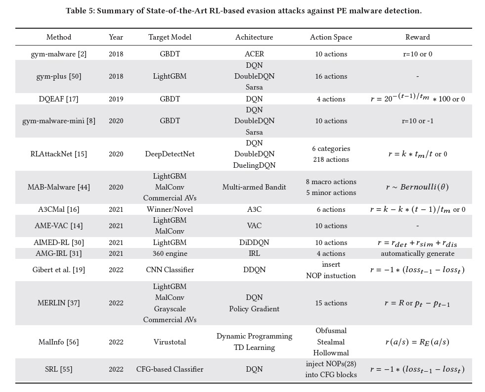

# PSP-Mal
> PSP-Mal: Evading Malware Detection via Prioritized Experience-based Reinforcement Learning with Shapley Prior

## Environment
PSP-Mal exposes OpenAI's `gym` environments and extends the [malware_rl](https://github.com/bfilar/malware_rl) repo to allow researchers to develop Reinforcement Learning agents to bypass LightGBM (Light Gradient Boosting Machine) Malware detectors. 
The LightGBM models, respectively trained on [Ember](https://github.com/endgameinc/ember) (Endgame Malware BEnchmark for Research) ([paper](https://arxiv.org/abs/1804.04637)) and [SOREL-20M](https://github.com/sophos/SOREL-20M) (SOREL-20M: A Large Scale Benchmark Dataset for Malicious PE Detection) ([paper](https://arxiv.org/abs/2012.07634)), were implemented to facilitate the comparison of the PSP-Mal and baseline methods.

### Action Space
Actions include a variety of non-breaking (e.g. binaries will still execute) modifications to the PE header, sections, imports and overlay and are listed below.

### Observation Space
The `observation_space` of the `gym` environments are a feature vector representing the malware sample. In this work， `numpy.array == 2381`.

### Agents

## Setup
To get `malware_rl` up and running you will need the follow external dependencies:

- Target detector - [Ember](https://github.com/Azure/2020-machine-learning-security-evasion-competition/blob/master/defender/defender/models/ember_model.txt.gz),  [SOREL-20M](https://github.com/sophos-ai/SOREL-20M) models. Model files need to be placed into the `malware_rl/envs/utils/` directory.

- Benign binaries - a small set of "trusted" binaries (e.g. grabbed from base Windows installation) you can download some via [PortableApps](https://portableapps.com). And then store these binaries in `malware_rl/envs/controls/trusted`

- Malware samples - Though we cannot release the malware downloaded by [Virustotal](https://www.virustotal.com/)，we offer the list of hashes of samples in `sample_hash.txt`

## Baselines

